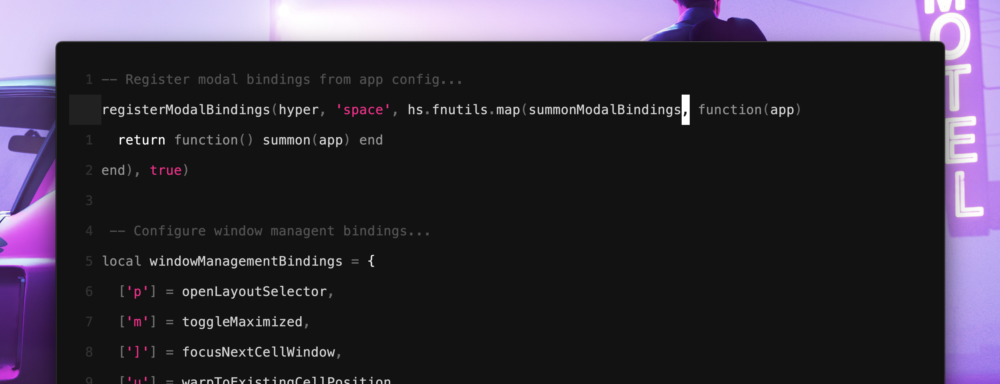
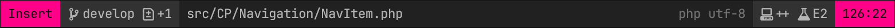
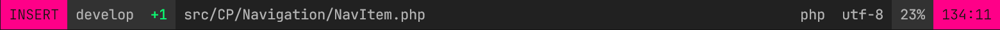

# Noirbuddy

A highly customizable minimalist theme building framework for Neovim 🖤

Built on [colorbuddy.nvim](https://github.com/tjdevries/colorbuddy.nvim), with a monochromatic base palette, and the ability to set a flavor color or two 💅



- [Installation](#installation)
- [Selecting Presets](#selecting-presets)
- [Customizing Your Theme](#customizing-your-theme)
- [Customizing Semantic Colors](#customizing-semantic-colors)
- [Customizing Font Styles](#customizing-font-styles)
- [Customizing Third Party Plugins](#customizing-third-party-plugins)
    - [Included Configs](#included-configs)
    - [Opt-In Configs](#opt-in-configs)
    - [Contributions](#contributions)
- [Customizing Highlight Groups](#customizing-highlight-groups)
- [Exporting Colors](#exporting-colors)
- [Thank You](#thank-you)

## Installation

1. Install using your favourite package manager:

    > ***Breaking changes:** If you were previously using colorbuddy's `dev` branch, please switch to master!*

    **Using [packer.nvim](https://github.com/wbthomason/packer.nvim):**

    ```lua
    use {
      "jesseleite/nvim-noirbuddy",
      requires = { "tjdevries/colorbuddy.nvim" }
    }
    ```

    **Using [lazy.nvim](https://github.com/folke/lazy.nvim):**

    ```lua
    {
      'jesseleite/nvim-noirbuddy',
      dependencies = {
        { 'tjdevries/colorbuddy.nvim' }
      },
      lazy = false,
      priority = 1000,
      opts = {
        -- All of your `setup(opts)` will go here
      },
    }
    ```

    **Using [vim-plug](https://github.com/junegunn/vim-plug):**

    ```vim
    Plug 'tjdevries/colorbuddy.nvim'
    Plug 'jesseleite/nvim-noirbuddy'
    ```

2. Enable the colorscheme in your lua config:

    > ***Note:** You can skip this step if you're using [lazy.nvim](https://github.com/folke/lazy.nvim)!*

    ```lua
    require("noirbuddy").setup()
    ```

3. Order pizza! 🍕 🤘 😎

## Selecting Presets

The default `minimal` preset consists of a monochromatic grayscale palette with one sexy `primary` color.

You can select from one of the bundled [presets](https://github.com/jesseleite/nvim-noirbuddy/tree/master/lua/noirbuddy/presets) like so:

```lua
require('noirbuddy').setup {
  preset = 'miami-nights',
}
```

### Available Presets


> [!CAUTION]
> If using lazy.nvim, avoid setting `vim.opt.colorscheme` altogether, as it can cause issues with loading your configured
> noirbuddy presets. Instead, you may use the `install = { colorscheme = { "noirbuddy" } }` configuration option.
> See [lazy.nvim's configuration](https://lazy.folke.io/configuration) for more details.

## Customizing Your Theme

You can configure a custom `primary` color like so:

```lua
require('noirbuddy').setup {
  colors = {
    primary = '#6EE2FF',
  },
}
```

For a more duotone look, you can configure a `secondary` color:

```lua
require('noirbuddy').setup {
  colors = {
    primary = '#6EE2FF',
    secondary = '#267FB5',
  },
}
```

You can also customize the `background` color:

```lua
require('noirbuddy').setup {
  colors = {
    background = '#18181A',
  },
}
```

Or even the base grayscale palette:

```lua
require("noirbuddy").setup {
  colors = {
    noir_0 = '#ffffff', -- `noir_0` is light for dark themes, and dark for light themes
    noir_1 = '#f5f5f5',
    noir_2 = '#d5d5d5',
    noir_3 = '#b4b4b4',
    noir_4 = '#a7a7a7',
    noir_5 = '#949494',
    noir_6 = '#737373',
    noir_7 = '#535353',
    noir_8 = '#323232',
    noir_9 = '#212121', -- `noir_9` is dark for dark themes, and light for light themes
  },
}
```

## Customizing Semantic Colors

You may wish to configure specific colors for things that have semantic meaning (ie. red for errors, orange for warnings, etc.), in a way that won't change as you switch between [presets](#selecting-presets):

```lua
require("noirbuddy").setup {
  colors = {
    diagnostic_error = '#EC0034',
    diagnostic_warning = '#ff7700',
    diagnostic_info = '#d5d5d5',
    diagnostic_hint = '#f5f5f5',
    diff_add = '#f5f5f5',
    diff_change = '#737373',
    diff_delete = '#EC0034',
  },
}
```

## Customizing Font Styles

Some highlight groups (ie. inline diagnostics) are set up so that you can opt-in to certain font styles (though which styles completely depends on the highlight group, and these are all disabled by default):

```lua
require("noirbuddy").setup {
  styles = {
    italic = true,
    bold = false,
    underline = false,
    undercurl = true,
  },
}
```

> If you want more granular control over font styles, check out the [customizing highlight grups](#customizing-highlight-groups) section.

## Customizing Third Party Plugins

### Included Configs

Noirbuddy automatically themes several [plugins](https://github.com/jesseleite/nvim-noirbuddy/tree/master/lua/noirbuddy/plugins) out of the box (ie. [telescope.nvim](https://github.com/nvim-telescope/telescope.nvim), [vim-fugitive](https://github.com/tpope/vim-fugitive), [harpoon](https://github.com/ThePrimeagen/harpoon), etc.), but also allows for [customizing highlight groups](#customizing-highlight-groups) and [exporting colors](#exporting-colors) so that you can have full control over every aspect when it comes to theming third party plugins.

### Opt-In Configs

Though noirbuddy handles highlight groups automatically, certain plugins may require you to opt-in to more opinionated lua-based theme configs...

- [mini.statusline](https://github.com/echasnovski/mini.statusline)

    

    ```lua
    local noirbuddy_statusline = require('noirbuddy.plugins.mini-statusline')

    require('mini.statusline').setup {
      content = {
        active = noirbuddy_statusline.active,
        inactive = noirbuddy_statusline.inactive,
      },
      -- ...
    }
    ```

    > Installing [mini.icons](https://github.com/echasnovski/mini.icons) is also recommended! Check out [@jesseleite's mini.statusline config](https://github.com/jesseleite/dotfiles/blob/7549a7823069de41a5895746cb2bcb32f5fd4b5b/nvim/lua/jl/plugins/mini-statusline.lua) for a fully fleshed out example.

- [lualine.nvim](https://github.com/nvim-lualine/lualine.nvim)

    

    ```lua
    local noirbuddy_lualine = require('noirbuddy.plugins.lualine')

    require('lualine').setup {
      options = {
        theme = noirbuddy_lualine.theme,
        -- ...
      },
      sections = noirbuddy_lualine.sections,
      inactive_sections = noirbuddy_lualine.inactive_sections,
      -- ...
    }
    ```

    > Check out [@n1ghtmare's lualine config](https://github.com/n1ghtmare/dotfiles/blob/4d5c489fd158692bb4f1713f0424d994df73bc8e/nvim/lua/plugins/lualine.lua) for a fully fleshed out example config!

- [nvim-cmp](https://github.com/hrsh7th/nvim-cmp)

    ```lua
    require('cmp').setup {
      window = require('noirbuddy.plugins.cmp').window,
      -- ...
    }
    ```

    > Nvim-cmp's default documentation popup is based off of Neovim's default float highlights, so it can be hard to read over top of your code window. This custom `window` config is recommended, as it adds unique highlight groups for Noirbuddy to style.

### Contributions

If you use a plugin that you think should be included in this repo, [PR's](https://github.com/jesseleite/nvim-noirbuddy/pulls) are welcome 🤘

## Customizing Highlight Groups

Since Noirbuddy is built on [colorbuddy.nvim](https://github.com/tjdevries/colorbuddy.nvim), you can use its API to customize specific highlight groups as needed:

```lua
-- Require colorbuddy...
local Color, colors, Group, groups, styles = require('colorbuddy').setup {}

-- Override specific highlight groups...
Group.new('TelescopeTitle', colors.primary)
Group.new('TelescopeBorder', colors.secondary)
Group.new('CursorLineNr', colors.primary, colors.noir_9)
Group.new('Searchlight', nil, colors.secondary)
Group.new('@comment', colors.noir_7)
Group.new('@punctuation', colors.noir_2)

-- Add font styles to highlight groups...
Group.new('@constant', colors.noir_2, nil, styles.bold)
Group.new('@method', colors.noir_0, nil, styles.bold + styles.italic)

-- Link highlight groups...
Group.link('SignifySignAdd', groups.DiffAdd)
Group.link('SignifySignChange', groups.DiffChange)
Group.link('SignifySignDelete', groups.DiffDelete)

-- etc.
```

## Exporting Colors

If you need access to Noirbuddy's raw color codes for other plugin configs:

```lua
-- Export noirbuddy colors...
local noirbuddy = require('noirbuddy.colors').all()

-- Outputs a simple lua table...
-- {
--   primary = "#e4609b",
--   secondary = "#47bac0",
--   background = "#18181a",
--   noir_0 = "#ffffff",
--   noir_1 = "#f5f5f5",
--   noir_2 = "#d5d5d5",
--   -- etc.
-- }
```

You can run `:lua print(vim.inspect(require('noirbuddy.colors').all()))` to see a full list of what is exported.

## Thank You!

- [Dimitar Dimitrov](https://twitter.com/dimitrov2k) for your contributions, slick ideas, and teamwork (this project is actually a spiritual successor to his awesome [noirblaze](https://github.com/n1ghtmare/noirblaze-vim) colorscheme) 💪

- [TJ DeVries](https://twitter.com/teej_dv) for your incredible work on [colorbuddy.nvim](https://github.com/tjdevries/colorbuddy.nvim) (and all things Neovim for that matter) 🤘

    
